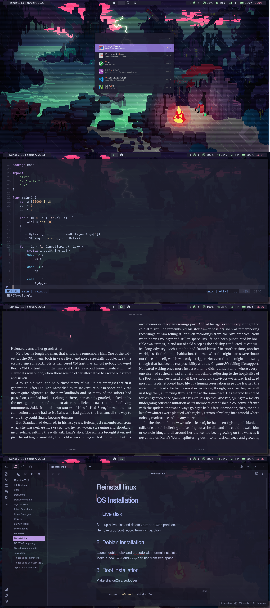

# Dotfiles for i3-gaps setup

GTK Theme: [Catppuccin](https://github.com/catppuccin/gtk)

VSCode Theme: [Catppuccin](https://github.com/catppuccin/vscode)

Neovim Theme: [Catppuccin](https://github.com/catppuccin/nvim)

Compositor: [Picom](https://github.com/yshui/picom)

Launcher: [Ulauncher](https://github.com/Ulauncher/Ulauncher)

WM: [i3](https://github.com/i3/i3)

Terminal: [Kitty](https://github.com/kovidgoyal/kitty)

Bar: [Polybar](https://github.com/polybar/polybar)

Notifications: [Dunst](https://github.com/dunst-project/dunst)

Shell: [zsh](https://ohmyz.sh)

Feel free to fork and make changes. Don't forget to leave a star :)
